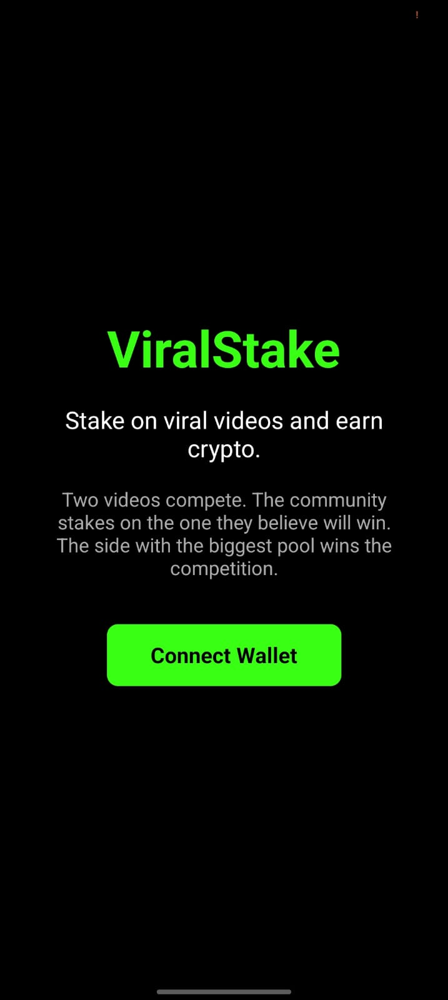
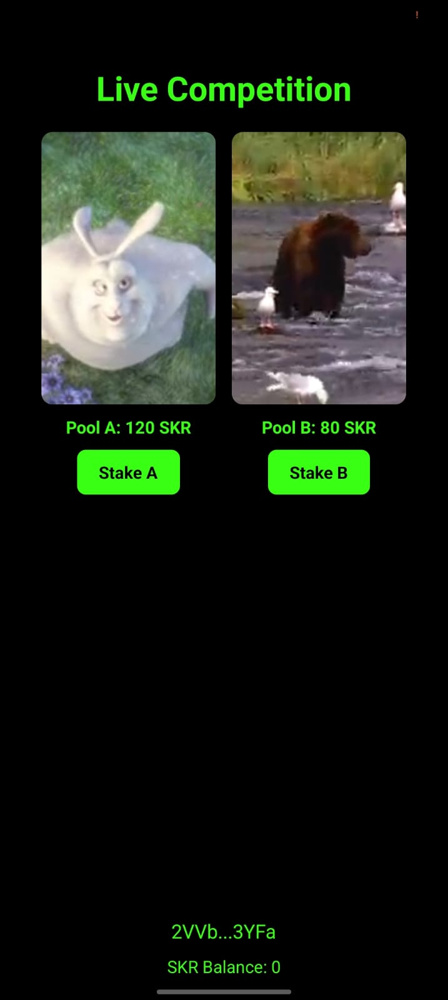
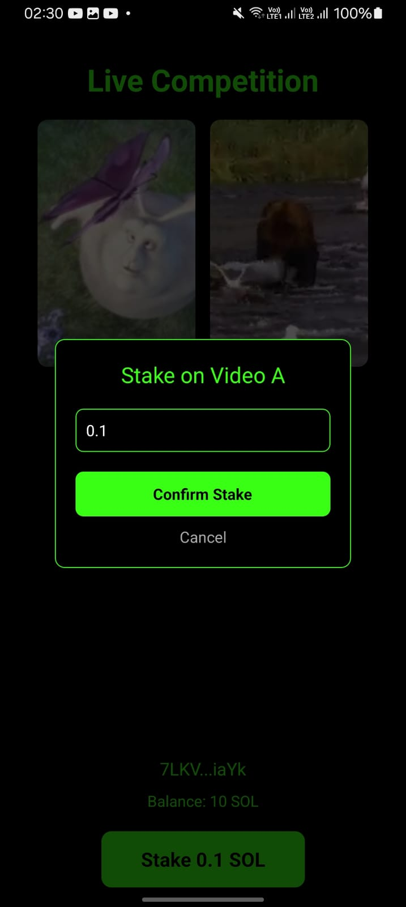
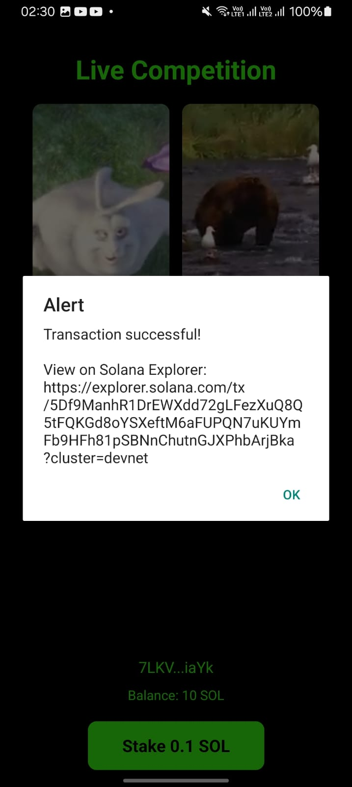
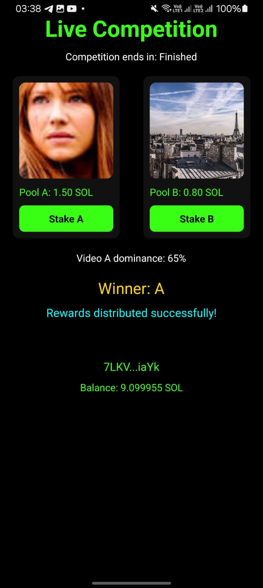

## ViralStake

### A Web3 Mobile app Where Users Stake on Viral Reels/TikToks and earn real crypto!

ViralStake is a Solana-powered mobile application that allows users to stake cryptocurrency(SKR) on short-form video 

competitions.

Creators upload their content, users stake (SKR)SOL on the creator they believe will win, and the creator with the highest 

engagement wins the reward pool.

This project explores a new form of creator economy powered by blockchain.

## Problem Statement

Social media platforms generate enormous engagement, but audiences rarely benefit financially from the success of content.

Creators earn revenue through ads or sponsorships, but users who discover and support viral content receive nothing.

This creates a one-sided creator economy. Also Only Big creators earn more money!

## Our Solution

ViralStake introduces a gamified staking platform where users can financially support creators they believe will go viral.

Users stake SOL on their favorite creator’s video, and if that creator wins the competition, they receive a share of the reward pool.

This transforms passive viewers into active participants in the creator economy.

New creatos also gets benifitted by new User engagement on their content

Check out this Notion Doc for more: https://www.notion.so/ViralStake-Monolith-Hackathon-Project-30f768fb84e380cd872ec269eacd14a2?source=copy_link

## IMPORTANT 

### for this Hackthon purpose we only integrated staking SOL feature, but The real Intention is to make the users able to stake SKR Token! 
## For Engagement Purpose we only calculated stakes = engagement later it can be upgraded to real time engagement tracking (Views, Likes, Comments, Shares) with anti bot Protection
## for the demo we used 2 public videos/ images from the internet , Later version upgrades this to real time video  uploading (using s3 maybe)

## How platform Works

- Creator Uploads a Video
- User Explores the competing videos in the app
- Users stake SOL on the creator they believe will win.
- Competition Goes on for a fixed time 
- Pool Grows 
- After the competition time ends, engagement metrics determine the winner.
- The pool is distributed among the Winning creator(20 %) and Users who staked on the winner (65 %)
- The platform keeps 15% 

## Monitary/Business Aspects

- For each competition the platform keeps 15% of staked amount
- For now it only supports competition between 2 videos only, but later we can upgrade it to more than 2 videos competiting resulting in a larger pool
- It is a completely new attention market with 0 competitiors in this. 

## Tech Stack

### Mobile App
- React Native
- Expo
- TypeScript
- React Navigation

### Backend
- Nodejs
- Express

### Blockchain

- Solana
- Solana web3.js
- Wallet Adapter

### Deployment
- Render (Backend Hosting)

## Screenshots

  
  
  

  
  

## Demo Video

## Installation

### Clone the Repository
`https://github.com/rajdeeprudra/Viral_Stake.git`

### Install Dependencies 
`npm install`

### Start the mobile development server
`npx expo start` 

### Running the backend

#### Navigate to backend folder

`cd server`
`npm install`
`node server.js`

### Get the android apk

`cd android ./gradlew assembleRelease`\

`android/app/build/outputs/apk/release/app-release.apk`

## Future Improvements

- On-chain smart contracts for reward distribution

- Automated engagement tracking

- Creator reputation system

- NFT rewards for viral creators

- Cross-chain staking support

- Advanced leaderboard system

## Vision

ViralStake aims to redefine the creator economy by rewarding not only creators but also the community that supports them.

By combining Web3 technology with social media engagement, we enable a new ecosystem where:

- creators gain funding

- audiences earn rewards

- viral content becomes a decentralized prediction market

## Author

Rudrax

Engineering student, Web3 enthusiast, and independent developer passionate about building decentralized social platforms.

